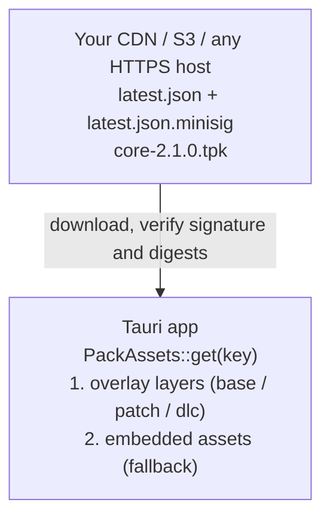

<p align="center">
  <h1 align="center">🔥🔁 tauri-plugin-tpk</h1>
  <p align="center">
    Open-source OTA frontend updates for Tauri v2 — ship HTML/CSS/JS changes without rebuilding the native binary. Self-hosted, signed, auto-rollback.
  </p>
</p>

<p align="center">
  <a href="https://crates.io/crates/tauri-plugin-tpk"></a>
  <a href="https://www.npmjs.com/package/tauri-plugin-tpk-api"></a>
  <a href="https://github.com/ChasLui/tauri-plugin-tpk/actions"></a>
  <a href="https://github.com/ChasLui/tauri-plugin-tpk/blob/main/LICENSE-MIT"></a>
</p>

<p align="center">
  <a href="#quickstart">Quickstart</a> ·
  <a href="https://chaslui.github.io/tauri-plugin-tpk/">Documentation</a> ·
  <a href="docs/api-reference.md">API Reference</a> ·
  <a href="docs/security.md">Security</a> 
</p>

---

## What is this?

An **open-source Tauri v2 plugin** that ships frontend updates to users without rebuilding the native binary and without requiring a cloud service. Self-hosted, bring your own CDN.

It works by swapping Tauri's embedded asset provider at startup. The WebView keeps loading from `tauri://localhost` — the swap is invisible. Your keys, your server, your infrastructure. If anything goes wrong, the app rolls back to embedded assets on next launch.

### Platform Support

| Platform | Status |
|----------|--------|
| macOS    | ✅ full |
| Windows  | ✅ full |
| Linux    | ✅ full |
| Android  | ⚠️ base/patch only — see [store boundaries](docs/security.md) |
| iOS      | ⚠️ base/patch only — see [store boundaries](docs/security.md) |

Content pack kinds by platform:

| Kind | Desktop | iOS | Android |
|------|---------|-----|---------|
| `base` / `patch` | ✅ | ✅ | ✅ |
| `dlc`  | ✅ | ❌ | ❌ |
| `mod`  | ✅ | ❌ | ❌ |


> **⚠️ This is not a tool for bypassing app store review.**
>
> TPK updates WebView content (HTML/CSS/JS/assets). Any change that alters what
> your app *does* — new native commands, new capabilities, new top-level routes,
> new purchase flows, new data collection — must ship through a store update.
>
> - **Apple**: content delivery is governed by the [Developer Program License
>   Agreement §3.3.1(B)](https://developer.apple.com/support/terms/apple-developer-program-license-agreement/),
>   which permits downloaded interpreted code only while it does not change the
>   app's primary purpose, does not bypass OS security, and does not create a
>   storefront. App Review cites [Guideline 2.5.2](https://developer.apple.com/app-store/review/guidelines/#software-requirements)
>   when it rejects. [Guideline 2.3.1(a)](https://developer.apple.com/app-store/review/guidelines/#accurate-metadata)
>   additionally requires you to disclose the OTA mechanism in Notes for Review.
> - **Google Play**: [Device and Network Abuse](https://support.google.com/googleplay/android-developer/answer/16559646)
>   states the restriction on downloading executable code *"does not apply to
>   code that runs in a virtual machine or an interpreter … such as JavaScript
>   in a webview or browser"*.
>
> Read [docs/security.md](docs/security.md) before shipping to a store. This
> project makes no compliance guarantee; the responsibility is yours.

### How it works



Packs are parsed out of a ZIP into memory and served through Tauri's `Assets`
trait. Nothing executable is written to disk. For any path, the highest layer
that mentions it wins — and a `delete` tombstone hides even an embedded asset.

---

<a id="quickstart"></a>

## 🚀 Quickstart

### 1. Install

```toml
# src-tauri/Cargo.toml
[dependencies]
tauri-plugin-tpk = "0.1.0"
```

```bash
pnpm add tauri-plugin-tpk-api
cargo install tpk-cli
```

### 2. Generate a signing key

```bash
tpk keygen --out tpk-secret.key   # prints the public key
```

Keep the secret key in a CI secret. Never commit it.

### 3. Configure

```json
{
  "plugins": {
    "tpk": {
      "manifest_url": "https://cdn.example.com/tpk/{{channel}}/latest.json",
      "pubkeys": [{ "key": "<YOUR_MINISIGN_PUBKEY>", "epoch": 1 }]
    }
  }
}
```

That is the whole required set — everything else has a default. The URL template
accepts `{{channel}}`, `{{arch}}`, `{{target}}` and `{{shell}}`, and nothing
else. There is no runtime setter for either field: a scripting bug in your
frontend must not be able to repoint the updater.

### 4. Register the plugin

```rust
// src-tauri/src/lib.rs
pub fn run() {
    let mut context = tauri::generate_context!();

    // `attach` swaps the asset provider before the app is built. It resolves no
    // paths and opens no files — on Android the data directory is not reachable
    // this early — so everything stateful happens in the plugin's setup hook.
    let tpk = tauri_plugin_tpk::attach(&mut context);

    tauri::Builder::default()
        .plugin(tauri_plugin_tpk::init(tpk))
        .run(context)
        .expect("error while running tauri application");
}
```

### 5. Add the capability

```json
{
  "identifier": "default",
  "windows": ["main"],
  "permissions": ["core:default", "tpk:default"]
}
```

`tpk:default` grants `check`, `download`, `notify_ready` and `status`. `reset`
needs `tpk:allow-reset` and is deliberately not in the default set.

### 6. Wire the frontend

```typescript
import { check, download, notifyReady } from 'tauri-plugin-tpk-api';

// Acknowledge the running revision — after your first screen has rendered,
// not at the top of your entry point. Until this is called the revision is on
// trial, and three unacknowledged launches roll it back.
await router.isReady();
await firstDataLoad();
await notifyReady();

const result = await check();
if (result.status === 'available') {
  await download();
  toast('Update ready — it will apply next time you open the app.');
}
```

`check()` and `download()` return a `status` for every ordinary answer —
`up_to_date`, `shell_required`, `disabled`, `degraded`. A rejected promise means
something you cannot act on.

There is no way to swap layers in a running process, on purpose: a WebView that
has already imported half a bundle would mix modules from two revisions.

### 7. Publish

```bash
pnpm build

tpk pack --kind base --id core \
  --version 2.1.0 --version-code "$(date -u +%Y%m%d%H%M%S)" \
  --created-at "$(date -u +%Y-%m-%dT%H:%M:%SZ)" \
  --dist dist/ --out core-2.1.0.tpk

tpk channel --channel stable --pack core-2.1.0.tpk \
  --url-base https://cdn.example.com/tpk/core/ \
  --watermark auto --out latest.json

tpk verify --pubkey "$TPK_PUBKEY" --file latest.json --file core-2.1.0.tpk

# Packs first, manifest last.
```

---

## ✨ What you get

| Property | What it means |
|---|---|
| 🔐 **Signed content** | minisign (Ed25519, prehashed) over the manifest, SHA-256 on every pack and every blob |
| ↩️ **Automatic rollback** | Three launches without `notifyReady()` and the revision rolls back and is blacklisted |
| 🧱 **Layered packs** | `base` / `patch` / `dlc` / `mod` stack over the embedded assets; highest layer wins |
| 📉 **bsdiff deltas** | A hotfix is kilobytes. Tombstones can hide files the binary still embeds |
| 🔑 **Key rotation** | Multiple trusted keys with a monotonic `key_epoch` floor |
| 🎚️ **Staged rollout** | Deterministic per-device bucketing; widening a rollout is a superset |
| ⏮️ **Replay protection** | Monotonic watermark, tracked per channel |
| ⚛️ **Atomic state** | Content-addressed layer pool; promotion is one `state.json` write with a directory fsync |
| 🧯 **Degraded mode** | Three consecutive rollbacks and automatic updating stops |
| 🔒 **https enforced** | Non-https manifest URLs are rejected |
| 🛡️ **Bounded decoding** | Every blob declares its encoded size; delta output is bounded by the signed size |
| 🗂️ **Static hosting** | A signed JSON file and some `.tpk` files. No API, no session, no vendor |

---

## 📖 Documentation

| Document | Description |
|----------|-------------|
| **[Philosophy](docs/philosophy.md)** | Why this exists, and when not to use it |
| **[Configuration](docs/configuration.md)** | Every field of `plugins.tpk`, and the permissions |
| **[API Reference](docs/api-reference.md)** | The TypeScript and Rust surfaces |
| **[Packaging](docs/packaging.md)** | Building, signing and publishing with the CLI |
| **[Architecture](docs/architecture.md)** | The crates, startup, the state machine |
| **[Overlay Resolution](docs/overlay.md)** | How layers stack and what wins |
| **[Disk Layout](docs/disk-layout.md)** | What lives where, and what the OS may delete |
| **[Server Contract](docs/server-contract.md)** | The channel manifest |
| **[Security](docs/security.md)** | Threat model and store boundaries |
| **[App Review Checklist](docs/app-review-checklist.md)** | What to disclose and test before submitting |
| **[The Updater Boundary](docs/updater-boundary.md)** | Pack or binary |
| **[Error Codes](docs/error-codes.md)** | The fourteen frozen codes |
| **[Local Testing](docs/local-testing.md)** | Serving a channel from your laptop |
| **[Migrating](docs/migrating-from-hotswap.md)** | Coming from the previous plugin |
| **[CONTRIBUTING](CONTRIBUTING.md)** | How to contribute |
| **[CHANGELOG](CHANGELOG.md)** | Version history |

The frozen format contract is [`spec/tpk-v1.md`](spec/tpk-v1.md). **Appendix A
overrides the body** — it records where the original specification conflicts with
Tauri's real API, with store policy, and with measured performance.

---

## 🛡️ Security

Content is signed with minisign and verified before it is used; every blob
carries its own digest, checked before decoding and again after. Nothing
executable is written to disk and no dynamic library is loaded.

One thing that surprises people: **pack content runs on `tauri://localhost` and
inherits every capability granted to that window.** If the window has
`shell:allow-execute`, a signed content pack is equivalent to arbitrary native
code execution. Audit `src-tauri/capabilities/` before you ship, and assert
`status().unsafe_capabilities` is empty in a smoke test.

See [docs/security.md](docs/security.md) for the full threat model, the real key
rotation SLA, and the store compliance boundaries.

## License

MIT OR Apache-2.0 (same as Tauri)
